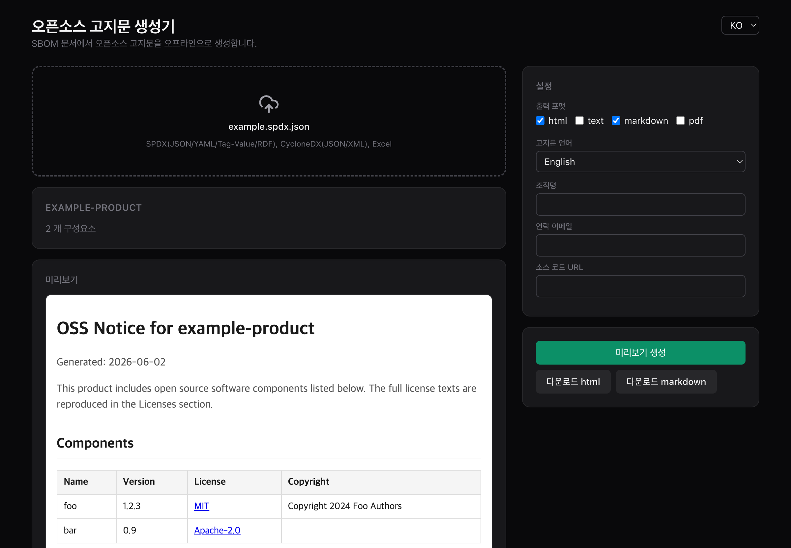

# onot

[](https://github.com/sktelecom/onot/actions/workflows/ci.yml)
[](https://github.com/sktelecom/onot/actions/workflows/security.yml)
[](LICENSE)
[](https://scorecard.dev/viewer/?uri=github.com/sktelecom/onot)
[](https://pypi.org/project/onot/)
[](https://github.com/sktelecom/onot/releases/latest)
[](https://github.com/sktelecom/onot/releases/latest)
[](https://github.com/sktelecom/onot/releases)

`onot` generates open source software notices (OSS Notice) from SBOM documents.
It reads [SPDX](https://spdx.dev) 2.x (JSON/YAML/Tag-Value/RDF),
[CycloneDX](https://cyclonedx.org) (JSON/XML), and Excel, and produces HTML, Text,
Markdown, and PDF notices. License texts are bundled, so it runs fully offline
(air-gapped) — your SBOM never leaves the machine. Jointly developed by Kakao and
SK telecom.



> User guide: [English](docs/USER_GUIDE.en.md) · [한국어](docs/USER_GUIDE.md)

## Download (desktop app)

No setup required. Grab the latest installer from
[Releases](https://github.com/sktelecom/onot/releases), open the app, and drop in an
SBOM file to preview and download a notice — Windows (`onot-Setup-x.y.z.exe`) and
macOS (`.dmg`).

The installers are unsigned. On first launch Windows SmartScreen may warn about an
"unknown publisher" — choose **More info → Run anyway**. On macOS, right-click the app
and choose **Open** to pass Gatekeeper.

## CLI

```bash
pip install "onot[spdx,cyclonedx,excel,api]"   # from PyPI; add ,pdf for PDF output

# SBOM (format auto-detected) → notices in multiple formats
onot generate -i sbom.spdx.json -f html -f markdown --output-dir ./output

#   -f/--format   html | text | markdown | pdf (repeatable)
#   --lang        ko | en
#   --config      onot.yaml (company info, etc.)
#   --online      fetch missing license texts remotely (offline by default)
#   --stdout      write a single text format to stdout

onot formats   # supported output formats
onot version
```

Input format is auto-detected by extension and content (including SPDX JSON vs.
CycloneDX JSON). PDF output needs `pip install ".[pdf]"` (WeasyPrint); the desktop app
uses a built-in converter.

## Local API (sidecar)

```bash
onot-sidecar --port 8765
# POST /api/parse    upload → parse result
# POST /api/render   upload + format/lang/company → notice
# GET  /api/formats, GET /healthz
```

## Desktop app (Electron)

```bash
pnpm -C frontend install && pnpm -C frontend build
pnpm -C electron install && pnpm -C electron start   # dev
pnpm -C electron run dist                            # package (.dmg/.exe/.AppImage)
```

Upload → preview → download. All processing is local; the SBOM never leaves the machine.

## Development

```bash
bash .claude/gate.sh   # lint + pytest (cov ≥ 90) + frontend build/test + electron sidecar test
```

Refresh license data with `python scripts/update_license_data.py` (bundles SPDX
license-list-data). Design and decision records live in `docs/2.0/`
(TRACEABILITY.md, DECISIONS.md).

## Contributing

Contributions are welcome! See [CONTRIBUTING.md](CONTRIBUTING.md) for how to set up
your environment, run the checks, and open a pull request. Please also read our
[Code of Conduct](CODE_OF_CONDUCT.md). To report a security vulnerability, follow
[SECURITY.md](SECURITY.md) instead of opening a public issue.

## Maintainers

| Name | Company | Email |
|--|--|--|
| [Rogers](https://github.com/HyunMinH) (한현민) | Kakao | um4825@gmail.com |
| [Haksung](https://github.com/haksungjang) (장학성) | SK telecom | hakssung@gmail.com |

## License

[Apache-2.0](https://www.apache.org/licenses/LICENSE-2.0)
