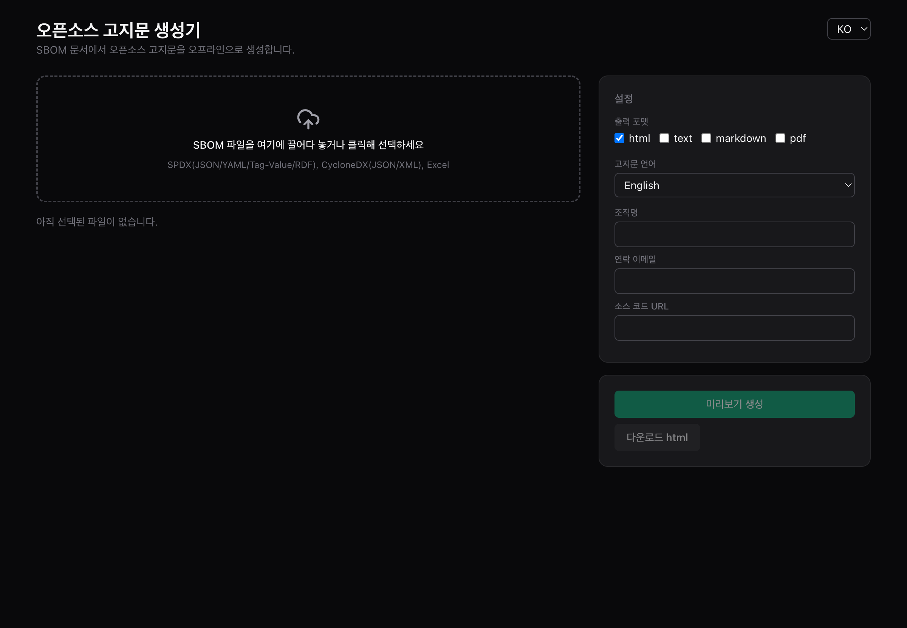
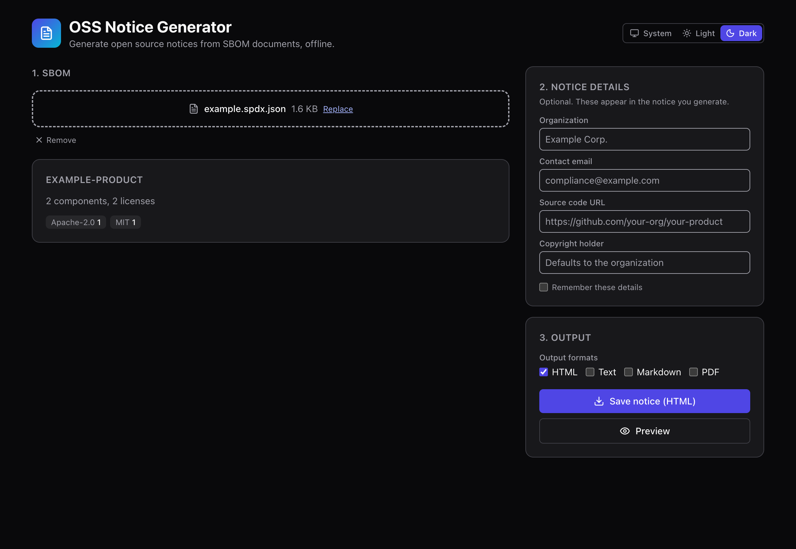
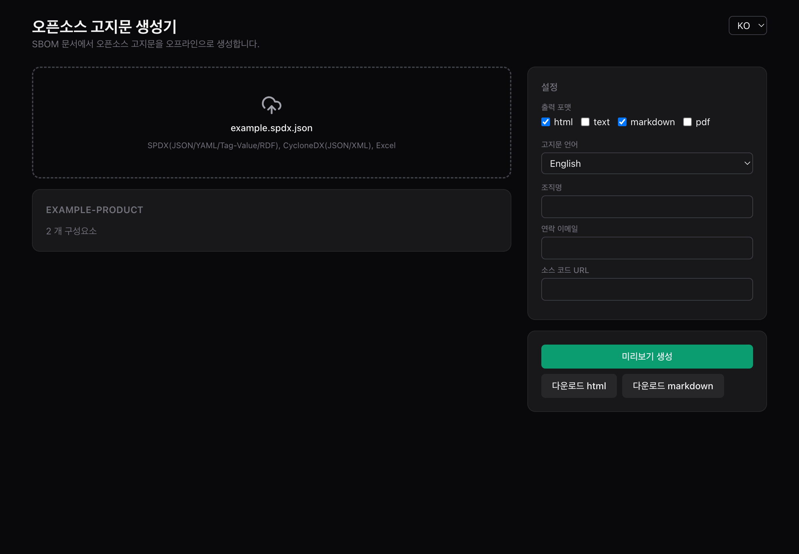

# onot 사용 가이드 (Windows)

> For English, see [USER_GUIDE.en.md](USER_GUIDE.en.md).

처음 오신 분도 따라 할 수 있도록 내려받기부터 고지문 내려받기까지 화면과 함께 설명합니다.
개발 도구를 설치할 필요는 없습니다. 설치 파일 하나만 받으면 됩니다.

모든 처리는 사용자 PC 안에서만 이뤄집니다. SBOM 파일이 외부 서버로 전송되지 않으며,
인터넷 연결 없이도 동작합니다.

## 1. 설치 파일 내려받기

[Releases 페이지](https://github.com/sktelecom/onot/releases)로 이동합니다. 가장 위에 있는
최신 버전에서 `onot-Setup-x.y.z.exe` 파일을 받습니다(`x.y.z`는 버전 번호).

## 2. 설치하기

받은 `onot-Setup-x.y.z.exe`를 두 번 눌러 실행합니다.

설치 파일에 코드 서명이 되어 있지 않아 처음 실행할 때 Windows SmartScreen이
"Windows의 PC 보호" 또는 "알 수 없는 게시자" 경고를 띄울 수 있습니다. 이때 창에 있는
`추가 정보`를 누르면 `실행` 버튼이 나타납니다. `실행`을 누르면 설치가 이어집니다.
설치가 끝나면 시작 메뉴와 바탕화면에 onot 아이콘이 생깁니다.

## 3. 앱 실행: 첫 화면

onot을 실행하면 아래 화면이 나타납니다. 오른쪽 위 `KO`/`EN` 선택으로 화면 언어를 바꿀 수
있습니다. 왼쪽의 점선 영역이 SBOM 파일을 올리는 자리이고, 오른쪽이 출력 설정입니다.

## 4. SBOM 파일 올리기

점선 영역에 SBOM 파일을 끌어다 놓거나, 영역을 눌러 파일 선택 창에서 고릅니다.
SPDX(JSON/YAML/Tag-Value/RDF), CycloneDX(JSON/XML), Excel 형식을 받습니다. 형식은 자동으로
인식하므로 따로 고를 필요가 없습니다.

파일을 올리면 문서 이름과 구성요소 개수가 표시됩니다. 아래 화면에서는 `example.spdx.json`을
올려 `EXAMPLE-PRODUCT`의 구성요소 2개가 인식됐습니다.

## 5. 출력 형식과 정보 고르기

오른쪽 설정에서 만들고 싶은 출력 형식을 고릅니다(html, text, markdown, pdf 중 여럿 선택 가능).
고지문 언어를 한국어나 영어로 정하고, 필요하면 조직명, 연락 이메일, 소스 코드 URL을 적습니다.
이 정보는 만들어지는 고지문에 함께 들어갑니다.

형식을 고르면 아래쪽에 형식별 내려받기 버튼이 생깁니다. 아래 화면에서는 html과 markdown을
함께 선택해 내려받기 버튼이 두 개 나타났습니다.

## 6. 미리보기 확인하고 내려받기

`미리보기 생성`을 누르면 화면 안에서 고지문을 미리 볼 수 있습니다. 구성요소 목록과 라이선스,
저작권 정보가 표로 정리되고 라이선스 전문도 함께 포함됩니다.

내용을 확인했으면 `다운로드 html`, `다운로드 markdown`처럼 원하는 형식의 버튼을 눌러 파일로
저장합니다. PDF는 선택 시 저장 위치를 묻는 창이 나타납니다.

## 자주 묻는 질문

설치할 때 SmartScreen 경고가 떠요.
: 설치 파일에 코드 서명을 적용하지 않아 생기는 안내입니다. `추가 정보`를 누른 뒤 `실행`을
  선택하면 설치됩니다.

인터넷이 없는 환경에서도 쓸 수 있나요?
: 됩니다. 라이선스 전문을 앱에 함께 담아 배포하므로 네트워크 없이 동작합니다.

내 SBOM 파일이 외부로 전송되나요?
: 아닙니다. 파싱과 고지문 생성은 모두 PC 안에서 이뤄집니다.

명령줄(CLI)이나 소스 빌드로도 쓸 수 있나요?
: 됩니다. [README](../README.md)의 CLI와 개발자용 안내를 참고하세요.
